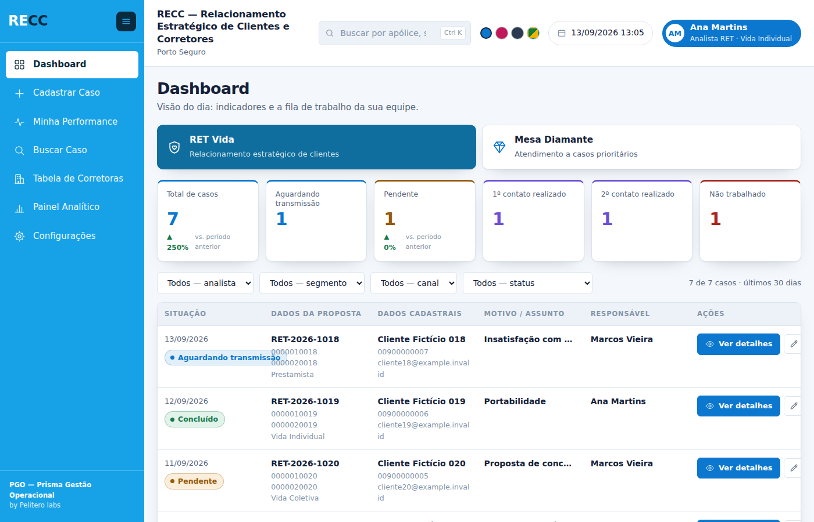

# Progresso

O estado de cada etapa, o que ela entregou e o que falta. Atualizado a cada
entrega.

**Estado geral:** 10 de 12 etapas construídas · 269 testes passando.

---

## Como as etapas foram organizadas

A ordem não é arbitrária: **cada etapa depende da anterior**, e cada uma
entrega algo que funciona sozinho e pode ser conferido na planilha. Nada de
"faz metade de tudo" — é uma camada de cada vez, testada antes da seguinte.

| # | Etapa | Estado | Testes |
|---|---|---|---|
| 1 | Fundação | ✅ pronta | 32 |
| 2 | Acesso | ✅ pronta | 32 |
| 3 | Casca | ✅ pronta | 28 |
| 4 | Cadastrar Caso | ✅ pronta | 28 |
| 5 | Dashboard | ✅ pronta · reformado | 28 |
| 6 | Configurações | ✅ pronta | 35 |
| 7 | Buscar Caso | ✅ pronta | 17 |
| 8 | Painel Analítico | ✅ pronta | 24 |
| 9 | Minha Performance | ✅ pronta | 19 |
| 10 | Tabela de Corretoras | ✅ pronta | 22 |
| 11 | Abas de análise | ⏳ | — |
| 12 | Diagnóstico | ⏳ | — |

---

## Etapa 1 — Fundação ✅

**O alicerce: como o dado entra e sai da planilha sem se corromper.**

| Arquivo | Entrega |
|---|---|
| `Back-End/Esquema.gs` | O contrato das 12 abas: cabeçalhos exatos e tipo de cada coluna |
| `Back-End/Planilha.gs` | A porta única para o Planilhas — nenhum outro arquivo chama `SpreadsheetApp` |
| `Back-End/Sequencia.gs` | Id decimal de 10 casas, que nunca anda para trás |
| `Back-End/Instalador.gs` | Cria as abas numa planilha vazia e cadastra o primeiro administrador |

As duas regras que nasceram aqui e valem para sempre: a coluna é encontrada
pelo **nome do cabeçalho**, nunca pela posição; e a faixa é **formatada antes**
de receber o valor.

**Bugs pegos:** 3 (ver [`04-bugs-capturados.md`](04-bugs-capturados.md) 1 a 3).

## Etapa 2 — Acesso ✅

**Quem entra, e o que cada um pode.**

| Arquivo | Entrega |
|---|---|
| `Back-End/Acesso.gs` | Níveis, escopo, senha de administrador, auditoria |
| `Back-End/Usuarios.gs` | Cadastro de quem pode entrar |
| `Back-End/Principal.gs` | `doGet`, pacote de partida, identidade visual |
| `Front-End/SemAcesso.html` | A tela de quem não está cadastrado |

Cargo e nível de acesso ficaram separados de verdade: o cargo é rótulo
organizacional e não decide nada. E toda recusa **diz o motivo** — quatro
motivos distintos, cada um levando a um lugar diferente.

**Bugs pegos:** 3 (itens 4 a 6).

## Etapa 3 — Casca ✅

**O que aparece em toda tela.**

| Arquivo | Entrega |
|---|---|
| `Front-End/Index.html` | O esqueleto, que cola os outros dentro de si |
| `Front-End/Estilos.html` | Toda a aparência e os quatro temas |
| `Front-End/Moldura.html` | Menu lateral e barra superior |
| `Front-End/Aplicacao.html` | Ponte com o servidor, roteador e telas |

Menu lateral azul da marca com pastilha branca no item atual. Barra superior na
ordem: identidade → busca → bolinhas de cor → data do último registro →
pessoa. Quatro temas trocáveis (padrão, rosa, escuro, Brasil), guardados por
usuário.

Nasceu aqui o `Evolucao/Testes/gerar-previa.js`, que monta as telas com o mesmo
código do servidor e abre em qualquer navegador — sem publicar no Apps Script.

**Bugs pegos:** 4 (itens 7 a 10), sendo **dois encontrados olhando a tela**,
que teste nenhum pegaria.


---

## Etapa 4 — Cadastrar Caso ✅

**A primeira tela que grava dado de verdade.**

| Arquivo | Entrega |
|---|---|
| `Back-End/Campos.gs` | O motor: monta o formulário a partir de `CAMPOS` e valida o que volta |
| `Back-End/Casos.gs` | Registrar, editar, ocultar e o selo da SUSEP |
| `Front-End/CadastrarCaso.html` | A tela, com máscara, seleção de mesa e o selo |

O formulário **não está escrito em lugar nenhum do código**: é montado a
partir da aba `CAMPOS` toda vez que a tela abre. Campo criado em Configurações
aparece sozinho; campo oculto para o nível **nem chega ao navegador**.

E porque o formulário é dado, o que volta da tela também é — então o servidor
revalida tudo:

- todos os problemas de uma vez, e não um por vez
- valor de campo oculto mandado pela tela é **ignorado**, não gravado
- data no futuro é recusada: o caso descreve algo que já aconteceu
- seletor só aceita valor que está na lista
- o escopo do nível vale para **escrever**, não só para ler

A máscara vive só na tela. `000.123.456-78` chega à célula como
`00012345678`, em texto.

O selo da SUSEP tem três respostas, e as três são informação: **liberada**
(com o segmento), **bloqueada** (com o motivo) e **não encontrada** — que não
é erro, é uma corretora que o cadastro não conhece.

**Bugs pegos:** 4 (itens 11 a 14), sendo um encontrado numa foto de página
inteira e um que era defeito da própria ferramenta de prévia.

---

## Etapa 5 — Dashboard ✅

**A visão do dia: quanto tem, e o que fazer agora.**

| Arquivo | Entrega |
|---|---|
| `Back-End/Painel.gs` | Cartões, fila, filtros e o detalhe de um caso |
| `Front-End/Dashboard.html` | A tela |
| `Front-End/SeletorDeMesa.html` | A escolha da mesa, usada aqui e no cadastro |

**Cartão e fila saem da mesma lista.** Contar de um lado e listar de outro
deixaria o cartão dizendo 12 e a fila mostrando 7, sem ninguém saber qual está
certo.

- Um cartão por situação, e **situação sem caso aparece zerada** — sumir do
  painel esconderia justamente a informação de que ela zerou
- **"Finalizados na célula"**: finalização preenchida e área responsável
  vazia. É conta, não coluna, então não mente quando alguém edita a área
  direto na planilha. A mesa que não declara essas colunas não ganha o cartão
- Os filtros **são os campos que já são lista**: nada escrito em código. Campo
  que virar seletor vira filtro sozinho
- O alcance do nível vale no painel: quem enxerga só os próprios casos tem
  cartões contando só os dele
- A fila abre o caso inteiro sem recarregar a tela, e o detalhe respeita a
  mesma regra de visibilidade do formulário

A mesa passou a declarar, na aba `MESAS`, onde guarda cada coisa:
`ColunaDoStatus`, `ColunasDaFila`, `ColunaDaFinalizacao` e
`ColunaDaAreaResponsavel`. Declarado, e não adivinhado pelo nome — adivinhar
acerta hoje e erra na mesa que vier depois.



---

## Etapa 6 — Configurações ✅

**A tela mais importante do produto: tudo o que as outras fazem sai daqui.**

`Back-End/Configuracoes.gs` e `Front-End/Configuracoes.html`, 35 testes.

### Três colunas

| Coluna | O que é |
|---|---|
| **Seções** | os sete assuntos, cada um com o seu tamanho ao lado |
| **Lista** | os itens da seção; clicar escolhe |
| **Propriedades** | o item escolhido, aberto para edição. Nada grava sem Salvar |

As sete seções: campos do formulário, usuários, níveis de acesso, listas,
mesas de trabalho, identidade e segurança, estrutura e auditoria.

### Três níveis de risco, três guardas

| O que se mexe | Guarda | Exemplo |
|---|---|---|
| **Conteúdo** | permissão `configurar` | renomear uma situação, cadastrar usuário |
| **Regra** | permissão `configurar` | o que um nível pode, quem vê qual campo |
| **Estrutura** | **+ senha de administrador** | criar coluna, apagar mesa |

A senha não é burocracia: criar coluna escreve na planilha de produção, e ali
não existe desfazer.

### As travas que o servidor já impõe

- **Trocar o cabeçalho de um campo é recusado** — cabeçalho é o nome da coluna
  na planilha. Rótulo, seção, máscara e obrigatoriedade são livres: isso é
  aparência, não endereço
- **Reordenar muda a tela, nunca a planilha.** Foi reordenando coluna que o
  sistema anterior corrompeu dado
- **Renomear um item de lista em uso é recusado**, dizendo em quantos casos ele
  está gravado — e oferecendo a saída certa, que é trocar o rótulo
- **Ninguém se tranca do lado de fora**: tirar Configurações do único nível que
  a tem, ou a estrutura do único que pode mexer nela, é recusado
- **Coluna apagada na planilha aparece marcada** na lista de campos, em vez de
  o campo parar de funcionar sem explicação

### E as travas que a tela acrescentou

- **A aba de uma mesa não muda por aqui** — os casos já gravados moram nela
- **Nome de coluna é escolhido numa lista**, nunca digitado: o nome que não
  existe é recusado dizendo quais existem, em vez de deixar o painel em branco
  dias depois
- **Desligar a última mesa ativa é recusado** — o Dashboard e o cadastro
  ficariam sem base nenhuma
- **A lista de telas é uma só.** `RECC_TELAS_DO_SISTEMA` alimenta o menu e a
  tela de níveis ao mesmo tempo; duas listas divergiriam, e a tela nova
  nasceria inacessível

### O diálogo da senha guarda a ação

Criar coluna pede a senha e, quando ela vem, **executa o que estava
pendente** — sem pedir o formulário de novo. Refazer tudo depois de digitar a
senha é o tipo de detalhe que faz alguém desistir no meio.

### A seção Painéis

Os cards do Dashboard deixaram de ser um texto separado por vírgula dentro da
mesa e viraram **linhas da aba `PAINEIS`**: cada um com nome, o que conta,
cor, ordem e o interruptor de mostrar. Até 12 por operação. Remover um card
não toca em caso nenhum — o card é uma forma de contar, e apagar a conta não
apaga o que foi contado.

### E o que ainda não é configurável

A lista completa, sem maquiagem, está em
[`06-o-que-e-configuravel.md`](06-o-que-e-configuravel.md): o que já se ajusta
pela tela, o que ainda exige abrir a planilha, e o que não se ajusta em lugar
nenhum — com o motivo de cada um.

---

## Dashboard, segunda passada 🔧

**A fila deixou de ser uma tabela e virou uma tela de trabalho.**

### A fila em grupos

Um caso da RET tem trinta e cinco colunas. Seis lado a lado perdem o resto;
trinta e cinco não cabem. A fila passou a aceitar **grupos**: várias colunas
debaixo de um título só, com a primeira em destaque e as outras de apoio.

```
Situação: data de recepção do protocolo, status
Dados da proposta: protocolo, número da proposta, Num_apolice, produto
Dados cadastrais: nome do cliente, CPF, e-mail
Motivo / assunto: motivo do cancelamento
Responsável: analista
```

A escrita antiga, sem dois-pontos, continua valendo: cada coluna vira um grupo
com o próprio nome. Nenhuma mesa precisou ser reescrita.

### O caso num modal

Clicar em **Ver detalhes** abre o caso por cima, e fechar devolve a fila
exatamente como estava — mesma rolagem, mesmo filtro, mesma linha. Sair e
voltar faria perder o lugar dezenas de vezes por dia.

Dentro do modal: o caso inteiro em duas colunas, **campo em branco com um
travessão** (sumir faria a pessoa achar que o campo não existe nesta mesa), o
**histórico do caso** tirado da trilha de auditoria, e o botão de editar.

A edição é o **mesmo formulário** de Cadastrar Caso — o `Formulario`, que
agora mora num arquivo só e é usado pelas duas telas. Dentro do modal ele
recebe um prefixo, porque a tela de cadastro pode estar atrás e os dois não
podem disputar os mesmos identificadores.

### As quatro ações da linha

| Ação | O que faz |
|---|---|
| **Ver detalhes** | abre o modal em leitura |
| **Editar** | abre o modal já em edição |
| **Alterar situação** | um diálogo pequeno, só com a situação — é o gesto mais frequente da operação, e abrir 35 campos para mexer num só é atrito que se paga dezenas de vezes por dia |
| **Excluir** | some do sistema para todo mundo; **a linha permanece na planilha** e pode voltar |

Concluir um caso preenche a data de finalização sozinho, quando a mesa tem
essa coluna e ela está vazia — é o que a operação faria à mão em seguida.

---

## Etapa 7 — Buscar Caso ✅

**O Dashboard mostra 30 dias. Aqui se acha o resto.**

`Back-End/Busca.gs` e `Front-End/BuscarCaso.html`, 17 testes.

### A regra que sustenta a tela

**Ler a coluna antes de ler as linhas.** Uma base da RET com 200 mil linhas
por 39 colunas são 7,8 milhões de células: ler tudo para procurar um
protocolo estoura o tempo do Apps Script e a cota da conta.

| Passo | Custo |
|---|---|
| 1. Ler só as **colunas de busca** e anotar em quais linhas o termo aparece | 5 colunas × 200 mil = 1 milhão de células |
| 2. Ler **inteiras** só as linhas que casaram | quase sempre uma ou duas |

Quais colunas cada mesa lê está em `MESAS.ColunasDaBusca`, e se ajusta em
Configurações. Mesa que não declara nenhuma **avisa** em vez de ler a base
toda.

### A comparação ignora máscara

`123.456.789-01` acha `12345678901`, e o contrário também. Nos dois sentidos,
porque a máscara pode estar de qualquer lado — no que a pessoa digitou ou no
que está gravado. Exigir o formato exato transformaria a busca em adivinhação.

Texto compara sem acento e sem caixa, procurando o termo **dentro** do valor:
`otavio` acha `Otávio Bandeira`.

### A planilha legada

O histórico que ficou no sistema anterior. Ela é lida **como está** — a
primeira linha é cabeçalho, e nada mais é assumido: nem tipo de coluna, nem
nome, nem ordem. Por isso procura em todas as colunas dela.

- O **Id é conferido na hora de apontar**. Guardar um Id que não abre deixaria
  a busca com um recado de erro para sempre, sem ninguém saber se era o Id ou
  a planilha que tinha sumido
- Uma linha do legado **não abre no modal**: ela não é um caso do sistema, é
  histórico. Prometer edição ali seria mentira
- A planilha fora do ar **não derruba** a busca na base própria: vira um
  recado ao lado dos resultados de verdade

### E o que a busca não faz

Não fura o alcance do nível. Quem só enxerga os próprios casos na fila também
só os acha na busca — esconder na fila e mostrar aqui seria uma porta dos
fundos. Caso ocultado também não volta.

---

## Etapa 8 — Painel Analítico ✅

**O Dashboard responde "o que eu tenho que trabalhar hoje". Aqui a pergunta é
outra: "o que está acontecendo na operação".**

`Back-End/Analitico.gs` e `Front-End/PainelAnalitico.html`, 24 testes.

Cada gráfico é uma linha da aba `PAINEIS` — tipo, campo que vira eixo, o que
se mede, o TOP N e a ordem. Acrescentar um gráfico é acrescentar uma linha,
em Configurações → Painéis → Gráficos.

### Cinco formas, cada uma para um trabalho

| Forma | Para quê |
|---|---|
| **Pizza** (rosca) | "de que tipo são", de relance. No máximo 6 fatias; o total no meio |
| **Barras em pé** | comparar "quanto de cada", com nomes curtos |
| **Barras deitadas** | o mesmo, com nomes compridos — em pé, "Aumento do prêmio na renovação" vira escadinha |
| **Linha** | como variou no tempo |
| **Barras com linha** | o dia a dia, com a tendência por cima |

### Três regras de leitura, e o motivo de cada uma

**Um eixo só.** "Barras com linha" não são duas escalas: a linha é a **média
móvel de 7 dias da própria barra**, na mesma altura. Dois eixos fazem a mesma
altura significar duas coisas — é o erro de gráfico mais comum que existe, e
um teste confere que a linha nunca ultrapassa a maior barra.

**Cor para identidade, tom único para magnitude.** A pizza responde "de que
tipo" e usa cores; as barras respondem "quanto" e usam um tom só. Seis cores
para dizer *quanto* fazem o olho comparar cores em vez de alturas.

**Cor segue a entidade, nunca a posição.** "Concluído" é verde porque o
catálogo diz que é, e continua verde quando um filtro o joga do primeiro para
o quarto lugar. Cor por posição repintaria o gráfico a cada filtro, e ninguém
compararia duas telas.

### A paleta

Seis tons em ordem fixa, **conferidos por régua e não por gosto**: separação
mínima entre vizinhos de ΔE 9,1 para quem não distingue vermelho e verde, e
19,6 para visão normal. Um sétimo valor vira **"Demais valores"** — nunca uma
cor nova, porque cor gerada na hora fica indistinguível das outras sob
daltonismo.

Três dos seis ficam abaixo de 3:1 de contraste com o fundo claro. A regra que
compensa isso está em todo gráfico: **o número sempre visível** (rótulo
direto), uma **tabela de números** a um clique e a **dica** no passar do
mouse. Cor é a segunda leitura, nunca a única.

O tema escuro tem os seus próprios passos, conferidos contra o fundo escuro —
não é a paleta clara reaproveitada.

### Clicar leva ao caso

Clicar numa fatia ou numa barra abre a lista dos casos que a formam, e dali o
mesmo modal do Dashboard. Sem isso o painel só informa, e informar não resolve
caso nenhum.

### Exportar

Ponto e vírgula e vírgula decimal — que é como o Excel em português abre sem
perguntar nada. Segue a permissão de `exportar`.

---

## Etapa 9 — Minha Performance ✅

**As outras telas mostram a operação. Esta mostra uma pessoa — e o cuidado
aqui é de outra natureza.**

`Back-End/Performance.gs` e `Front-End/MinhaPerformance.html`, 19 testes.

Um número mal escolhido no Dashboard atrapalha uma decisão. Um número mal
escolhido aqui atrapalha alguém. Quatro decisões saíram disso:

### 1. O ranking segue o alcance do nível

Quem só enxerga os próprios casos **não vê nome de colega nenhum** — vê a
própria posição contra a média da equipe. Mostrar a lista a quem não pode ver
os casos dos outros seria uma porta dos fundos, e ainda por cima a mais
constrangedora que existe num sistema de trabalho.

Quem pode ver recebe a lista — mas dos **vizinhos**, não o pódio. Um pódio
completo diz muito pouco a quem está no meio e diz demais sobre quem está
embaixo.

### 2. Todo número vem com a sua base

"8 casos" sozinho não diz nada; "8 contra 6 no período anterior" diz. E a
média da equipe aparece **sempre**: "abaixo da média" sem saber qual é a média
não é informação, é só desconforto.

Sem base de comparação a variação fica **em branco** — inventar "+100%" porque
saiu de zero é ruído que a operação aprende a ignorar, junto com a variação
que importa.

### 3. Menos é melhor, às vezes

No **tempo médio até concluir**, cair 20% é boa notícia — e a tela pinta de
verde. A mesma seta para baixo em "concluídos" é o contrário. Pintar as duas
da mesma cor faria a tela dar a notícia errada.

### 4. O que não dá para calcular não aparece

Tempo médio exige que a mesa declare a coluna de finalização. Sem ela, o
indicador **some** — não aparece zerado, que pareceria desempenho ruim. Mesa
sem coluna de responsável não mostra zero: mostra o que falta configurar.

### A meta é declarada, nunca inventada

`MESAS.MetaMensalPorPessoa`, e zero desliga. Alvo tirado do nada é pior que
alvo nenhum: ele parece oficial, e ninguém sabe de onde saiu. A barra é
proporcional ao período escolhido, e passar da meta **enche a barra** — o
número diz o resto. Barra estourando a caixa é defeito, não conquista.

### "O que você fez"

A trilha da própria pessoa, e **só o que é trabalho**: cadastrou, alterou,
mudou situação, procurou. Mexer numa configuração é ação de quem administra, e
essa trilha completa vive em Configurações — aqui é a memória de quem atende,
e ela não pode virar log de sistema.

### E o desenho dos gráficos virou um módulo

`Front-End/Graficos.html`. Duas telas desenham gráficos e agora não têm duas
cópias — pela razão que já custou caro aqui: regra copiada em dois lugares é
regra que um dia diverge, e num gráfico a divergência não dá erro. Vira uma
barra um pouco mais alta do que devia.

---

## Etapa 10 — Tabela de Corretoras ✅

**Três cadastros que sustentam o resto do sistema e que, até aqui, só se
ajustavam abrindo a planilha.**

`Back-End/Corretoras.gs` e `Front-End/TabelaCorretoras.html`, 22 testes.

| Aba | O que é |
|---|---|
| **Corretoras e canais** | `CANAIS` — quem traz o caso, com o segmento |
| **Produtos** | `PRODUTOS` — o código é único, porque é ele que liga ao caso |
| **SUSEPs bloqueadas** | `SUSEP_BLOQUEADAS` — com o motivo, obrigatório |

### O que faz a tela valer mais que uma lista

**O volume ao lado de cada corretora.** Uma tabela de corretoras sem volume é
uma agenda telefônica; com ele, responde "quem me dá trabalho" — e a lista vem
ordenada por isso, não por ordem alfabética.

**E o aviso das SUSEPs fora do cadastro.** Esse é o achado. Enquanto uma SUSEP
não está em `CANAIS`, o selo do formulário diz "não encontrada" toda vez que
alguém a digita — e o sintoma aparece *na outra tela*, uma pessoa de cada vez,
sem ninguém ligar à causa. Aqui elas aparecem juntas, com quantos casos cada
uma já trouxe e o nome que os próprios casos usam, e cadastrar é um clique.

Uma SUSEP **bloqueada** não entra nessa lista: ela é conhecida, e o selo mostra
o bloqueio, não "não encontrada". Aviso que não bate com o que a pessoa vê na
outra tela é aviso que a operação aprende a ignorar.

### Três decisões

- **"Não encontrado" é atenção, não erro.** Cadastro incompleto não é corretora
  irregular; pintar de vermelho faria a operação achar que há problema com quem
  trouxe o caso
- **Bloquear não impede cadastrar.** O formulário mostra o selo vermelho com o
  motivo, e quem atende decide. Bloqueio que impedisse faria a pessoa registrar
  o caso num caderno, e o sistema perderia o caso de vista
- **O motivo do bloqueio é obrigatório.** Quem vir o selo vermelho daqui a seis
  meses precisa saber o que fazer com a informação

### A trava do cadastro

Duas corretoras com a mesma SUSEP são recusadas: o selo escolheria uma delas
pela ordem da planilha, que ninguém controla. O mesmo vale para o código do
produto.

---

## Configurações, segunda passada 🔧

Três perguntas da operação e um pedido de estilo, respondidos juntos.

### O menu ficou como o do PGO 5

Um cartão só, com os oito assuntos dentro, cada linha numa grade de três
colunas fixas — **ícone, título, quantidade**. As três colunas são o motivo de
a do meio ser `1fr` e não `auto`: com `auto`, o título manda na largura e os
números do lado direito param cada um num lugar.

Os títulos encurtaram (*Campos*, *Identidade*, *Estrutura*) porque não cabiam
em uma linha, e título que quebra em duas desalinha a contagem. O que eles
deixaram de dizer, a descrição diz — que saiu do menu, onde se repetia oito
vezes, e virou a primeira linha da coluna do meio.

**O item escolhido foi medido, não escolhido a olho.** Com o texto em
`--destaque-sobre`:

| tema | tom cheio | tom escuro |
|---|---|---|
| padrão | `#0B77CE` · 4,62 | `#095CA1` · **6,87** |
| rosa | `#C2185B` · 5,87 | `#8E1145` · **9,07** |
| brasil | `#0E7A3C` · 5,43 | `#0A5A2C` · **8,36** |
| dark | `#5C9DFF` · 6,55 | `#7FB4FF` · **8,37** |

No tema Dark o "escuro" é mais CLARO que o tom cheio, e o texto por cima é
quase preto. É por isso que o par certo é sempre `--destaque-escuro` com
`--destaque-sobre`: os dois viram juntos, tema a tema.

### Por analista virou gráfico

A operação perguntou se o Painel Analítico tinha os dois recortes. **Por área**
sempre teve, e não como gráfico: é o seletor de mesa. Um gráfico "casos por
área" com duas barras compararia RET Vida com Mesa Diamante, que têm colunas,
situações e volumes incomparáveis — a Mesa sempre pareceria pequena, e nunca
foi para ser grande.

**Por analista** faltava, e agora nasce junto com o sistema nas duas mesas, em
barras deitadas: nome de pessoa é comprido, e em pé o rótulo vira escadinha.

### A aba Importar

A pergunta era: *"temos uma lista de SUSEPs bloqueadas e quais corretoras são
Diamante — eu teria que fazer manual?"*

Não. Três passos, e o do meio é o que importa:

| passo | o que faz |
|---|---|
| **Colar** | Copia da planilha que a operação já tem. TAB (o que o Excel põe na área de transferência) ou ponto e vírgula, com ou sem cabeçalho |
| **Conferir** | O servidor diz o que vai acontecer com CADA linha — cadastra, atualiza, já igual, recusada e por quê. **Não grava nada** |
| **Aplicar** | Só então grava, e pede a senha de administrador |

**Aplicar não confia em Conferir.** Manda o TEXTO de novo, e o servidor refaz a
conferência inteira antes de escrever. Receber do navegador a lista já
conferida seria gravar o que o servidor aprovou — mas depois de passar por um
lugar onde qualquer coisa pode ter mudado.

**Nada apaga.** Uma corretora que está no cadastro e não veio no texto colado
continua onde estava; um campo vazio no texto não limpa o que já existe. O
texto colado é uma correção, não a verdade inteira.

Com cabeçalho, a ordem das colunas pode ser qualquer uma: quem exporta de
outro sistema não recebe as colunas na ordem do PGO, e exigir a ordem certa
devolveria à pessoa exatamente o trabalho manual que a tela veio tirar.

### O diálogo de senha saiu de Configurações

Virou `SenhaDeAdministrador.html`, porque a Importação passou a precisar do
mesmo pedido. Dois diálogos escritos separados viram duas regras: um dia um
libera por 5 minutos e o outro por 30, e ninguém percebe.

### E um bug que só a tela mostrou

O [23](04-bugs-capturados.md): a linha colada era aparada ANTES de ser partida
em colunas, e com TAB isso comia a primeira coluna quando ela vinha vazia. A
linha inteira andava uma casa, e a recusa apontava o campo errado. Os quinze
testes da importação passavam — nenhum deles tinha primeira coluna vazia, e
escrever esse caso não teria ocorrido a ninguém antes de ver a linha torta na
tela.

**285 testes.**

---

## Responsividade

Uma conferência à parte, num navegador de verdade:

```bash
node Evolucao/Testes/conferir-responsividade.js
```

**7 telas × 12 larguras**, de 1600px a 320px, procurando a página rolar na
horizontal e o elemento que escapou da janela. Tabela dentro de uma caixa que
rola de propósito não conta — rolar a tabela é a solução, não o problema.

Na suíte ficam as regras estáticas que sustentam isso: nenhuma largura fixa
acima de 320px no CSS, toda tabela dentro de uma caixa que rola, e a grade dos
gráficos com `minmax(min(100%, 340px), 1fr)`, que encolhe sozinha sem media
query nenhuma.

---

## O que ainda está em aberto

| Assunto | Situação |
|---|---|
| **Escopo `EQUIPE`** | Implementado como "mesmo canal que atende", única noção de equipe que a estrutura tem. Se a operação usa hierarquia de supervisão, vira uma coluna nova em `USUARIOS` e só `filtrarPeloAlcance_` muda |
| **Logo da operação** | A chave `IDENTIDADE.LOGO_URL` aceita endereço `https` ou a imagem embutida em texto. Enquanto vazia, o nome faz as vezes da logo |
| **Nome das telas, janela da fila e tema padrão** | Moram em `CONFIG` e ainda se ajustam só na planilha. São os próximos a ganhar tela |
| **Criar e apagar mesa** | A tela ajusta as mesas que existem. Criar uma mesa nova é estrutura (cria aba), e ainda não passa por Configurações |
| **Volume** | 30 mil linhas hoje ocupam ~9% do teto de 10 milhões de células. Ver a seção 8 de [`01-arquitetura.md`](01-arquitetura.md) |
