# PGO — Prisma Gestão Operacional

**Sistema de gestão de casos sobre Google Planilhas e Google Apps Script.**
Sem servidor, sem banco de dados externo, sem custo de infraestrutura.

Desenvolvido por **Pelitero Labs**.

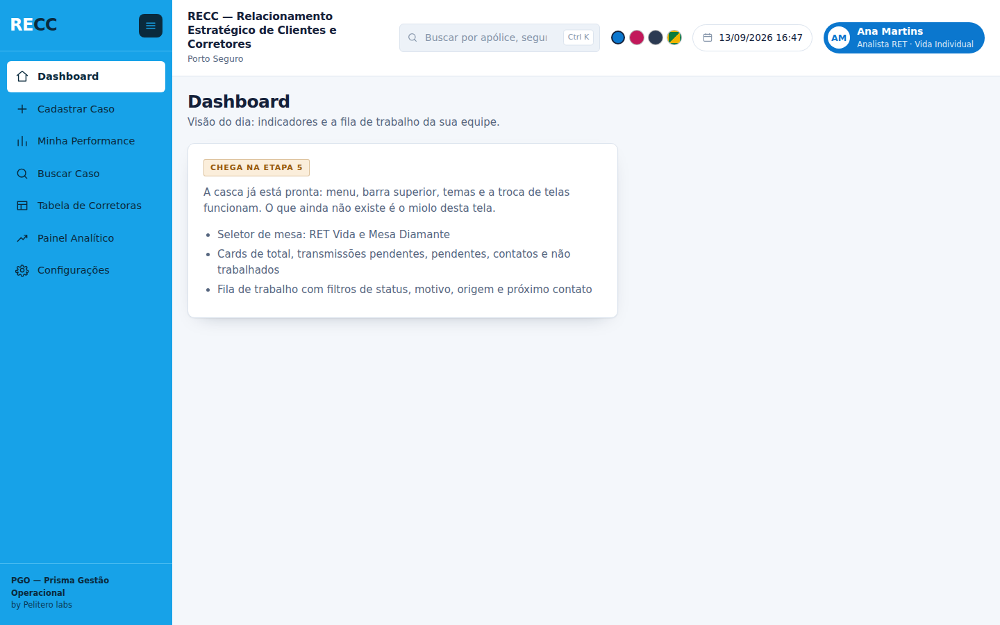

> **Uma etapa só está pronta quando funciona, a suíte passa cinco vezes e
> está publicada aqui.** Etapa que fica na máquina de alguém não existe.

---

## O que é

**PGO** é a plataforma, pensada para servir a diferentes operações de
atendimento. **RECC — Relacionamento Estratégico de Clientes e Corretores** é a
operação montada sobre ela, em Porto Seguro.

Nome, subtítulo, logo, cor e até os títulos do menu vivem na **aba `CONFIG` da
planilha**. Servir outra operação é trocar essas linhas, não é mexer em código.

O sistema atende dois canais de trabalho, e aceita uma terceira sem tocar em
código:

| Canal | Base | O que é |
|---|---|---|
| **RET** | `BASE_RET` | Retenção — relacionamento estratégico de clientes |
| **Mesa Diamante** | `BASE_MESA` | Atendimento a casos prioritários |

### As telas

`Trabalho` · `Cadastrar Caso` · `Minha Performance` · `Buscar Caso` ·
`Tabela de Corretoras` · `Importação` · `Produtividade RECC` · `Configurações`

Cada uma aparece — ou não — conforme o **nível de acesso** de quem entrou.

**Os nomes acima são só os de fábrica.** O administrador renomeia qualquer tela
em Configurações › Identidade, e o menu, o cabeçalho da página e o título da
janela passam a usar o nome novo. O que identifica a tela para o sistema é uma
CHAVE interna que nunca muda — por isso renomear não quebra rota, nível de
acesso nem endereço guardado. Três telas já trocaram de nome assim, sem que
nada quebrasse: `Dashboard` virou `Trabalho`, `Painel Analítico` virou
`Produtividade RECC` e `Tombamento` virou `Importação` — este último porque os
casos que entram por ali **são incorporados para serem tratados**, e "tombar"
dizia só que eles tinham mudado de lugar.

### Os quatro temas

Trocáveis a qualquer momento, guardados por usuário: **Padrão** (azul da
marca), **Rosa**, **Escuro** e **Brasil**.

| | | |
|---|---|---|
| 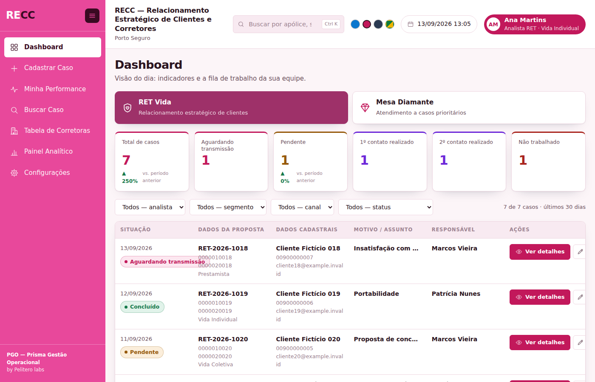 | 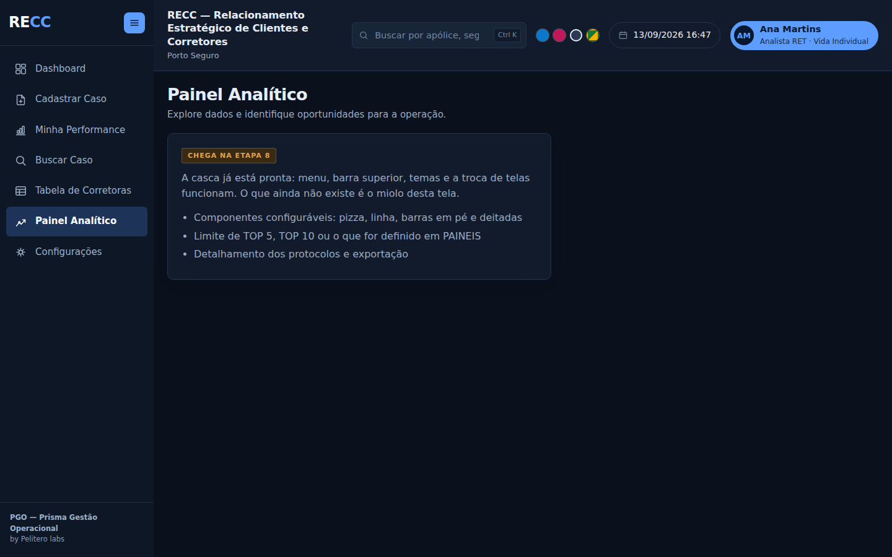 | 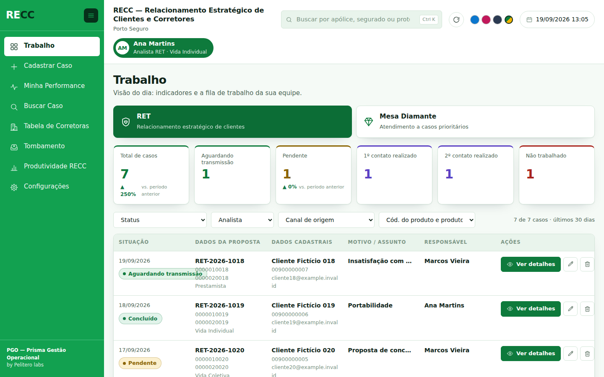 |

---

## Como o repositório está organizado

```
Back-End/     os arquivos .gs — rodam no Apps Script, no servidor do Google
Front-End/    os arquivos .html — rodam no navegador de quem usa
Evolucao/     tudo que NÃO vai para o Apps Script
```

Os nomes das duas primeiras pastas são **etiquetas de destino**: elas dizem
para onde cada arquivo vai no editor do Apps Script. O que separa de verdade os
dois grupos é onde o código executa — `.gs` no Google, `.html` no navegador.

Dentro de `Evolucao/`:

| Caminho | O que é |
|---|---|
| [`01-arquitetura.md`](Evolucao/01-arquitetura.md) | O modelo de dados e **por que** cada decisão foi tomada |
| [`02-padrao-de-codigo.md`](Evolucao/02-padrao-de-codigo.md) | Como os nomes são escolhidos, e as exceções |
| [`03-manutencao.md`](Evolucao/03-manutencao.md) | Como mexer sem quebrar — leia antes de tocar em código |
| [`04-bugs-capturados.md`](Evolucao/04-bugs-capturados.md) | Todo defeito encontrado, com sintoma, causa e defesa |
| [`05-progresso.md`](Evolucao/05-progresso.md) | O estado de cada uma das 14 etapas |
| [`06-o-que-e-configuravel.md`](Evolucao/06-o-que-e-configuravel.md) | O que se ajusta pela tela, o que só na planilha e o que ainda não se ajusta |
| `Testes/` | A suíte: 531 testes, que rodam no computador com `node` |
| `imagens/` | As telas |

---

## Instalação

1. Crie uma planilha **nova e vazia** no Google Planilhas, e um projeto do
   Apps Script vinculado a ela.

2. Copie os arquivos. **O projeto do Apps Script não tem pastas** — as daqui
   são organização do repositório. Há dois caminhos:

   ### Já tem o PGO instalado? Migre, não reinstale

   Numa rodada, "mesa" virou **canal** em todo o sistema, e a aba `CANAIS` —
   que guardava corretoras — cedeu o nome. Uma planilha instalada antes disso
   continua com as abas antigas: o sistema abre, mas **sem canal nenhum**, e o
   Trabalho nasce vazio.

   Depois de copiar os arquivos novos, rode **uma vez** no editor do Apps
   Script:

   ```
   migrarParaCanais()
   ```

   Ela renomeia as duas abas, renomeia a coluna `MesaId`, acrescenta as
   colunas novas do contrato e — o passo menos óbvio — **leva a sequência de
   Id junto com a aba**. Sem isso a contagem recomeçaria do zero e o sistema
   reemitiria um Id já gravado, que é o defeito que custou 4.328 colisões no
   PGO 5.x.

   **Não apaga nada, e pode rodar duas vezes sem estragar.** Depois dela,
   `diagnosticoRECC()` para conferir.

   > O que ela NÃO faz, de propósito: não mexe no formulário, nos cartões nem
   > nas listas. Eles ganharam padrões novos, mas a sua instalação pode ter
   > sido ajustada à mão — e sobrescrever configuração é perder trabalho em
   > silêncio. Para pegar os padrões novos, ajuste em Configurações, ou
   > instale numa planilha vazia.

   ### O caminho curto: três arquivos

   A pasta **[`Evolucao/pacote/`](Evolucao/pacote/)** tem o sistema inteiro
   junto, pronto para colar:

   | Cole este | Num arquivo chamado | Que é |
   |---|---|---|
   | `Codigo.gs` | `Codigo` (arquivo **.gs**) | os 7 arquivos do servidor |
   | `Index.html` | `Index` (arquivo **HTML**) | o esqueleto com as 10 telas dentro |
   | `SemAcesso.html` | `SemAcesso` (arquivo **HTML**) | a tela de acesso negado |

   **Atenção ao nome:** no Apps Script o arquivo se chama `Index`, e não
   `Index.html` — sem extensão, sem acento, com as maiúsculas iguais.

   > O pacote é **gerado**, não escrito à mão: `node
   > Evolucao/Testes/gerar-pacote.js`. O teste ponta a ponta roda contra ele e
   > contra os 19 arquivos soltos, e cobra que os dois se comportem igual — senão
   > haveria duas verdades, e a que a operação usa seria a que ninguém testa.

   ### O caminho longo: arquivo por arquivo

   Vale quando você vai mexer no código: cada arquivo fica separado por
   assunto, como no repositório.

   | Aqui | No editor do Apps Script |
   |---|---|
   | `Back-End/Entrada.gs` | `Entrada.gs` |
   | `Front-End/Index.html` | `Index.html` |
   | `Evolucao/` | **não vai** |

   São **19 arquivos** — 7 do servidor e 12 de tela —, e basta **um** ficar
   para trás para uma tela congelar numa mensagem de carregamento. A ordem não
   importa: o Apps Script avalia os `.gs` em ordem alfabética, e nenhum tem
   código de topo que dependa de outro.

   | Servidor (7) | Responde |
   |---|---|
   | `Base.gs` | como o sistema fala com a planilha |
   | `Cadastros.gs` | quem traz o caso para dentro |
   | `Casos.gs` | o caso, do formulário à busca |
   | `Config.gs` | o que se ajusta sem programador |
   | `Entrada.gs` | quem entra e o que pode |
   | `Indicadores.gs` | os números |
   | `Instalacao.gs` | criar e conferir a instalação |

   | Tela (12) | O que é |
   |---|---|
   | `Index.html` | o esqueleto, que manda incluir os outros |
   | `Estilos.html` | toda a aparência e os quatro temas |
   | `Comuns.html` | as peças que mais de uma tela usa |
   | `Aplicacao.html` | a ponte com o servidor e o roteador |
   | `Trabalho.html` … `Configuracoes.html` | uma por item do menu (8) |
   | `SemAcesso.html` | a tela de quem não está cadastrado |

   ### O caminho de quem tem terminal: `clasp`

   O `clasp` é a ferramenta oficial do Google e evita a cópia manual por
   completo — os 19 arquivos sobem de uma vez, e sobem de novo a cada mudança:

   ```bash
   npm install -g @google/clasp
   clasp login
   clasp clone <id-do-projeto>   # o id está em Configurações do projeto
   # copie Back-End/*.gs e Front-End/*.html para a pasta clonada
   clasp push
   ```

3. Publique como **aplicativo da web** (executar como você).

4. No editor, execute **`instalarRECC()`** uma vez. Ela cria as 13 abas, semeia
   o catálogo e **cadastra você como o primeiro administrador**.

   > Esse último passo não é conveniência: o acesso é pelo e-mail autenticado
   > conferido contra a aba `USUARIOS`, e uma base nova tem essa aba vazia. Sem
   > ninguém dentro, ninguém entra — e sem entrar, ninguém cadastra.

5. Confira com **`verificarEstruturaRECC()`**. Ela só lê, e diz em segundos
   duas coisas: se alguma **aba** do contrato ficou faltando, e se algum
   **arquivo de tela** ficou para trás na cópia — com o nome de cada um.

   > Nenhum teste rodado fora do Apps Script pega isso: a suíte lê a pasta do
   > repositório, onde os arquivos estão. Quem pode não tê-los é o projeto.
   >
   > No Apps Script o arquivo se chama `Formulario`, e não `Comuns.html`:
   > sem extensão no nome, sem acento, e com as maiúsculas iguais.

6. Se alguma tela ficar **parada numa mensagem de carregamento** — "Lendo o
   cadastro…", "Somando os casos…" —, é arquivo `.gs` que ficou para trás.
   Cole `Evolucao/conferir-projeto.gs` num arquivo novo e execute
   **`oQueFaltaNoProjeto`**: ela não depende de nenhum outro arquivo do PGO e
   diz quais copiar. Depois é só apagá-la.

   > Quando a função não existe no servidor, a chamada estoura antes de sair
   > do navegador, num ponto em que o tratamento de erro da tela ainda nem foi
   > registrado. Nada aparece — a tela só congela.

7. Para a conferência completa, execute **`diagnosticoRECC()`**. São dez
   blocos — fuso, estrutura, sequências de Id, Ids repetidos, canais, campos,
   painéis, análises, quem consegue configurar, e se toda função que a tela
   chama existe no servidor. Também só lê, e escreve o laudo no log.

   > Ela roda no editor de propósito: é a porta que importa quando o sistema
   > **não abre**. A mesma conferência está em Configurações › Estrutura,
   > atrás de um botão.

8. Abra o sistema e defina a senha de administrador.

**A instalação recusa rodar sobre uma planilha que já tenha dado.** É a única
rotina do sistema que cria estrutura; depois dela, nenhum caminho do produto
cria, renomeia, apaga ou reordena aba e coluna por conta própria.

Nenhum dado operacional é semeado: bases, canais, produtos e SUSEPs bloqueadas
nascem vazios.

---

## Conferir a responsividade

```bash
node Evolucao/Testes/conferir-responsividade.js
```

Abre a prévia num navegador de verdade e percorre **as 7 telas em 12
larguras** — do monitor de 1600px ao celular de 320px —, procurando a página
rolar na horizontal e o elemento que escapou da janela. Tabela dentro de uma
caixa que rola de propósito não conta: rolar a tabela é a solução, não o
problema.

Precisa do Playwright, e por isso fica **fora** da suíte: `rodar.js` roda com
`node` puro, sem instalar nada, e essa promessa vale mais do que ter tudo num
comando só.

---

## Rodar os testes

```bash
node Evolucao/Testes/rodar.js
```

531 testes. O critério de aceite é **cinco execuções seguidas sem falha** —
rodar uma vez não detecta teste instável.

A suíte roda contra um Google Planilhas falso que **converte valores igual ao
de verdade**: numa célula de formato Geral, `'00000010'` vira `10` e
`'000000E1'` vira `0`. Há um teste dedicado só a provar que o simulador
realmente corrompe — sem ele, os outros 530 não valeriam nada.

## Ver as telas sem publicar

```bash
node Evolucao/Testes/gerar-previa.js
```

Escreve `previa/sistema.html` e `previa/sem-acesso.html`, que abrem em qualquer
navegador. São montados pelo **mesmo código do servidor**; só a ponte com o
Google é substituída. Serve para conferir menu, temas e navegação sem publicar
a cada mudança.

---

## A visão do dia

Cartões e fila saem da **mesma lista**, já filtrada pelo alcance do nível — por
isso o número do cartão sempre bate com o que a fila mostra. Os filtros são os
campos que já são lista: nada escrito em código.

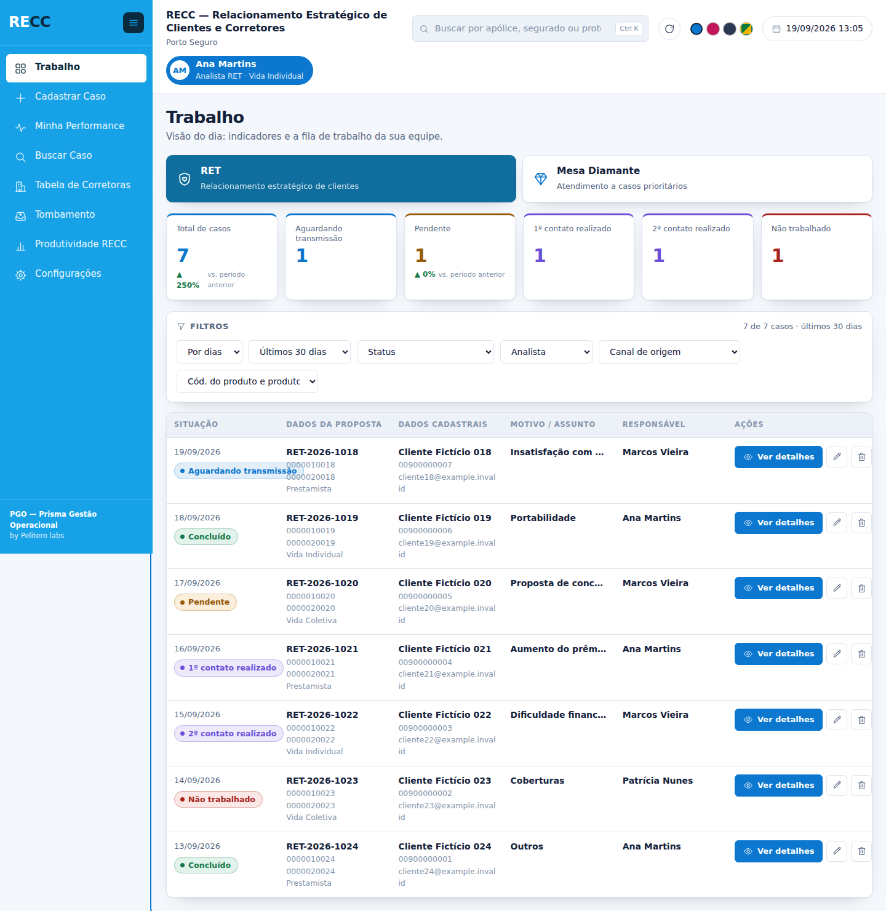

Tudo o que filtra mora numa **caixa branca, com o título "Filtros"** e, do lado
direito, **quantos casos estão sendo mostrados e de qual período**. É a mesma
caixa nas três telas que filtram — Trabalho, Minha Performance e Produtividade
RECC —, desenhada por uma peça só (`Moldura.caixaDeFiltros`). A contagem ao
lado do título é o que evita a leitura errada mais comum: um filtro esquecido
ligado, a tela com três casos, e ninguém entendendo por quê.

O primeiro filtro é o **período**, nas mesmas três maneiras da Produtividade
RECC (ver adiante): por dias, por data e por mês. Antes o Trabalho olhava só a
janela fixa da `CONFIG` — os mesmos 30 dias para todo mundo —, e quem
precisasse fechar uma semana ou um mês tinha de exportar e contar fora.

Quando a fila sai vazia, o recado diz **o período que ela olhou**, com as
palavras do próprio filtro: "nada foi registrado no período escolhido —
setembro de 2026". Dizer "nos 30 dias mais recentes" com setembro escolhido
mandaria a pessoa procurar defeito onde não há.

A fila vem em **grupos**: várias colunas debaixo de um título só, com a
primeira em destaque. Um caso da RET tem trinta e cinco colunas — seis lado a
lado perdem o resto, e trinta e cinco não cabem.

Clicar em **Ver detalhes** abre o caso por cima, e fechar devolve a fila
exatamente como estava. Campo em branco aparece com um travessão: sumir faria
a pessoa achar que o campo não existe naquelo canal.

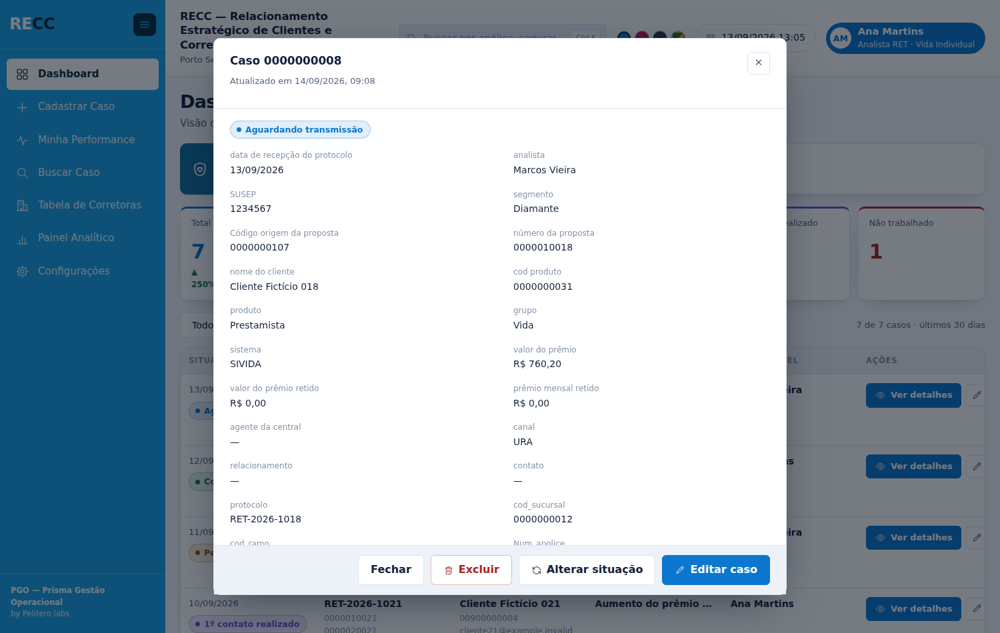

Cada linha tem quatro ações: ver, editar, **alterar situação** — um diálogo só
com a situação, porque é o gesto mais frequente da operação — e excluir, que
tira o caso do sistema e **mantém a linha na planilha**.

---

## O cadastro de casos

O formulário **não está escrito no código**. Ele é montado a partir da aba
`CAMPOS` toda vez que a tela abre — campo criado em Configurações aparece
sozinho, e campo oculto para o nível de acesso nem chega ao navegador.

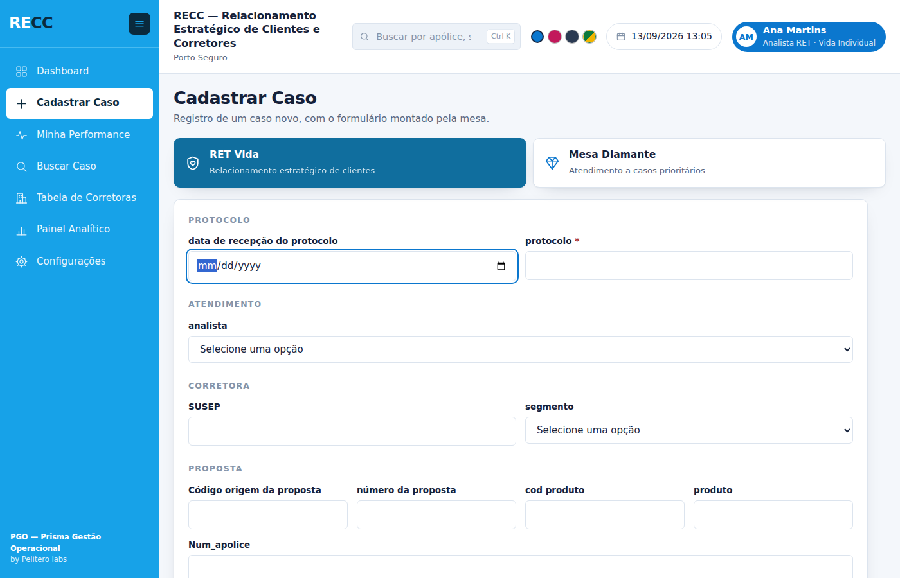

O selo da SUSEP responde três coisas, e as três são informação: **liberada**
com o segmento, **bloqueada** com o motivo, ou **não encontrada** — que não é
erro, é uma corretora que o cadastro ainda não conhece.

---

## Achar um caso que a fila não mostra mais

O Trabalho mostra os últimos 30 dias, de propósito. Quando o cliente liga
citando um protocolo de abril, é aqui que se procura.

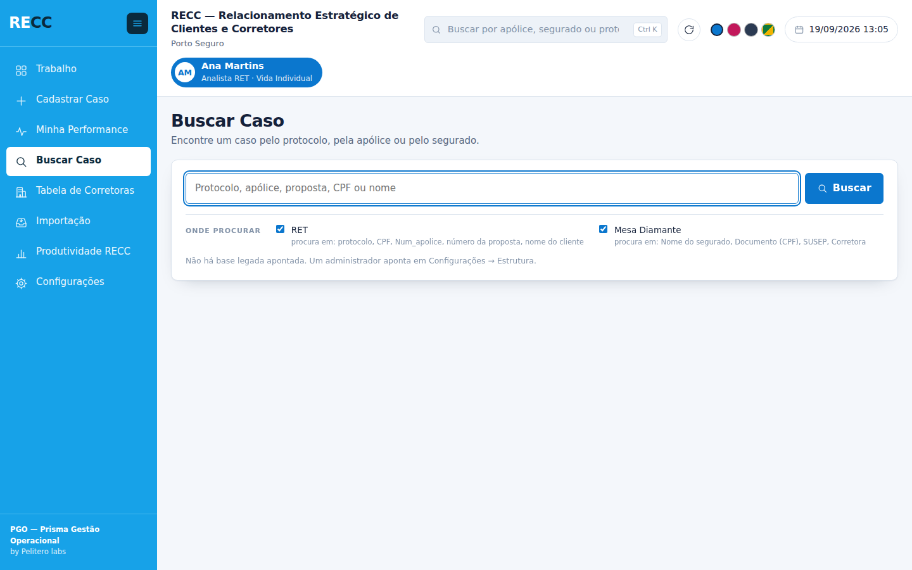

A tela existe sobre uma regra: **ler a coluna antes de ler as linhas**. Uma
base de 200 mil linhas por 39 colunas são 7,8 milhões de células — ler tudo
estoura o tempo do Apps Script. Lemos só as **colunas de busca** que o canal
declarou, anotamos em quais linhas o termo aparece, e só então lemos inteiras
as poucas que casaram.

A comparação **ignora máscara nos dois sentidos**: `123.456.789-01` acha
`12345678901` e vice-versa. E quando há uma **planilha legada** apontada, ela
entra como uma origem a mais — lida como está, em leitura, sem prometer
edição do que não é caso do sistema.

---

## O que a operação entregou — a Produtividade RECC

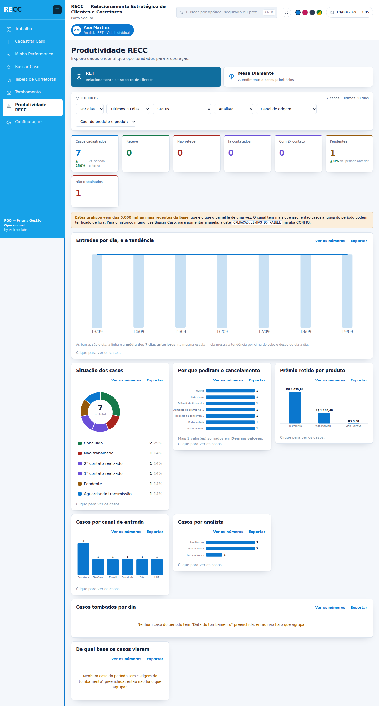

A tela abre pelos **cartões**, porque é o cartão que responde a pergunta: para a
RET, quantos **reteve**, quantos **não reteve**, quantos **já foram contatados**,
quantos estão **cadastrados** e quantos **pendentes**. O gráfico vem depois, e é
a explicação.

"Já contatados" sai do **carimbo**, e não do status de hoje. Um caso que passou
do "1º contato realizado" e hoje está em "Reteve" continua tendo sido contatado
— contar pelo status diria zero, e a operação concluiria que ninguém ligou para
ninguém. A coluna de carimbo não esquece.

E o carimbo vale para **toda** porta: o diálogo de situação, o formulário
inteiro aberto pelo lápis e o cadastro de um caso novo. Por um tempo só o
diálogo carimbava, e o mesmo caso na mesma situação ficava com data ou sem data
conforme onde a pessoa tivesse clicado — a conta ficava pela metade sem errar
em nada visível. É o achado 43.

**Esta tela é da EQUIPE, e não tem botão para trocar:** Minha Performance é
sobre uma pessoa, a Produtividade RECC é sobre o grupo, e cada pergunta tem a
sua tela. Quem quiser o número de uma pessoa dentro da equipe usa o filtro de
Analista — isso é recortar a equipe, e não trocar de assunto.

**Quem vê a produtividade de quem é NÍVEL DE ACESSO**, com quatro respostas:

| Alcance | O que o nível vê aqui |
|---|---|
| **Bloqueado** | a tela não abre — some do menu |
| **Próprios** | só os casos da própria pessoa |
| **Equipe** | quem atende o mesmo canal que ela *(o padrão)* |
| **Canal** | o canal inteiro, de todos os analistas |

Isso é **independente do "até onde enxerga"** do nível. Um analista com escopo
"próprios" e Produtividade em "equipe" vê a equipe **aqui** e continua vendo só
os casos dele na fila de trabalho: são duas perguntas diferentes — "o que eu
tenho para fazer" e "como a equipe está indo" —, e elas não precisam ter a mesma
resposta.

E **quais** canais aparecem continua sendo a lista de canais do nível: quem abre
só a RET e tem "o canal inteiro" vê a RET inteira, não a Mesa Diamante.

### O período, de três maneiras

Vale para as **três telas que filtram** — Trabalho, Minha Performance e
Produtividade RECC. É a mesma peça (`SeletorDePeriodo`) nas três: duas cópias
divergiriam no primeiro ajuste, e a operação veria três telas diferentes
fazendo a mesma pergunta.

| Maneira | Para quê |
|---|---|
| **Por dias** | "Últimos 30 dias". É o do dia a dia, e continua sendo a abertura |
| **Por data** | Duas datas, de/até. Responde uma pergunta específica: a semana da campanha, os dias da virada |
| **Por mês** | "Setembro de 2026". É como a operação REPORTA — e é diferente de "últimos 30 dias": no dia 20 de outubro, os últimos 30 dias pegam metade de setembro e metade de outubro, e nenhum fechamento se faz assim |

Quem resolve as três é o **servidor**. Se a tela calculasse as datas, o dia do
gráfico sairia do relógio de quem está olhando e o dia da conta sairia do
relógio da planilha — num fechamento de mês, essa diferença é um dia inteiro de
casos.

No mês, o período anterior é **o mês anterior inteiro**, e não "os 30 dias antes
do dia 1". Em fevereiro, a segunda conta erraria por três dias todo ano.

Cada gráfico é uma linha da aba `PAINEIS` — nada aqui está escrito no código.
Cinco formas: pizza, barras em pé, barras deitadas, linha e barras com linha.
Clicar numa fatia abre a lista dos casos que a formam.

Três regras sustentam a leitura, e cada uma existe por um motivo:

- **Um eixo só.** "Barras com linha" não são duas escalas — a linha é a
  **média móvel de 7 dias da própria barra**, na mesma altura. Dois eixos
  fazem a mesma altura significar duas coisas
- **Cor para identidade, tom único para magnitude.** A pizza responde "de que
  tipo são" e usa cores; as barras respondem "quanto" e usam um tom só
- **Cor segue a entidade, nunca a posição.** "Concluído" é verde porque o
  catálogo diz que é, e continua verde depois de qualquer filtro

A paleta é de seis tons em ordem fixa, **conferidos por régua**: ΔE 9,1 de
separação mínima sob daltonismo, 19,6 na visão normal. Um sétimo valor vira
"Demais valores", nunca uma cor nova. E como três dos seis ficam abaixo de
3:1 de contraste, todo gráfico traz o **número visível**, a **tabela** a um
clique e a dica no passar do mouse — cor é a segunda leitura, nunca a única.

---

## A tela em que o analista se vê

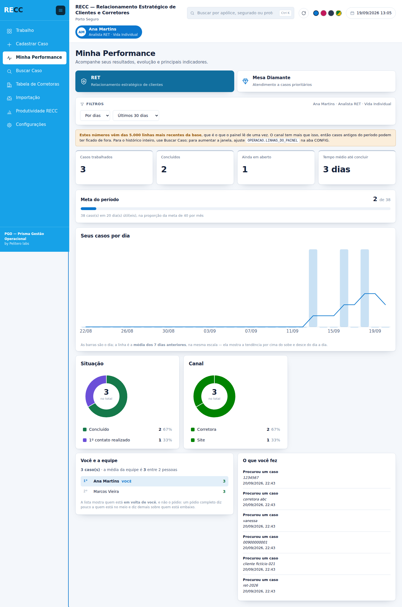

As outras telas mostram a operação; esta mostra **uma pessoa**, e o cuidado é
de outra natureza. Um número mal escolhido no Trabalho atrapalha uma decisão;
aqui, atrapalha alguém.

- **O ranking segue o alcance do nível.** Quem só enxerga os próprios casos não
  vê nome de colega — vê a própria posição contra a média. E quem pode ver
  recebe os **vizinhos**, não o pódio: um pódio diz pouco a quem está no meio e
  demais sobre quem está embaixo
- **Todo número vem com a sua base**, e a média da equipe aparece sempre
- **No tempo médio, menos é melhor** — cair é verde. A mesma seta para baixo em
  "concluídos" é o contrário
- **O que não dá para calcular some**, em vez de aparecer zerado
- **A meta é declarada, nunca inventada.** Canal sem meta não ganha barra
- **A meta conta DIA ÚTIL, e desconta férias** — ver a seção seguinte

**Esta tela é sobre MIM, sempre** — as minhas inclusões. A equipe continua
aparecendo, mas como REFERÊNCIA: a média e a minha posição, no bloco de baixo.
Saber que se fez 8 não diz nada sem saber que a média é 6. O que ela não faz é
virar o assunto da tela — para isso existe a Produtividade RECC.

### O calendário: dias úteis, feriados e férias

A operação **só trabalha em dias úteis**, e todo mês alguém entra de férias. As
duas coisas mexem na mesma conta — quantos dias a pessoa realmente tinha para
trabalhar — e é essa conta que a meta usa.

Antes a meta se repartia por **30 dias corridos**. Num mês de 21 dias úteis
isso cobrava trabalho de nove dias que não existem, e a barra acusava um atraso
que era só do calendário. Quem tirava férias piorava: aparecia devendo os dias
em que estava fora.

Agora:

| conta | como é hoje |
|---|---|
| **Denominador da meta** | Os dias úteis **daquele mês** — que variam de 19 a 23. Num mês fechado o alvo bate exatamente com a meta mensal |
| **Ausência** | Desconta os dias úteis em que a pessoa esteve fora. Uma semana de férias que pega um fim de semana são 5 dias, não 7 |
| **Média da equipe** | Quem esteve ausente sai da média e da posição, e continua na lista com a marca de quantos dias ficou fora |

**Os feriados nacionais o sistema calcula sozinho** — inclusive Carnaval,
Sexta-feira Santa e Corpus Christi, que mudam de data todo ano. Eles saem do
**Domingo de Páscoa**, pelo algoritmo gregoriano, conferido contra quinze anos
de datas conhecidas. A alternativa seria uma tabela que alguém teria de
preencher todo dezembro — e esquecer uma vez faz a meta de fevereiro sair
errada sem ninguém entender por quê.

A Consciência Negra só conta **de 2024 em diante**, que é quando virou nacional
(Lei 14.759/2023). Contar antes tiraria um dia útil de um ano em que a operação
trabalhou.

O que o sistema **não** adivinha — o feriado municipal, o ponto facultativo que
a área de fato não trabalha, a emenda — fica em **Configurações › Calendário**,
junto das ausências. E lá também se faz o contrário: marcar *"neste dia a
operação TRABALHA"* cancela um feriado nacional, para o ano em que se trabalhou
no Corpus Christi.

**Férias não bloqueiam o acesso.** A pessoa continua entrando no sistema — quem
volta às vezes precisa consultar um caso antes de reassumir. O que muda é a
conta.

---

## Quem traz o caso para dentro

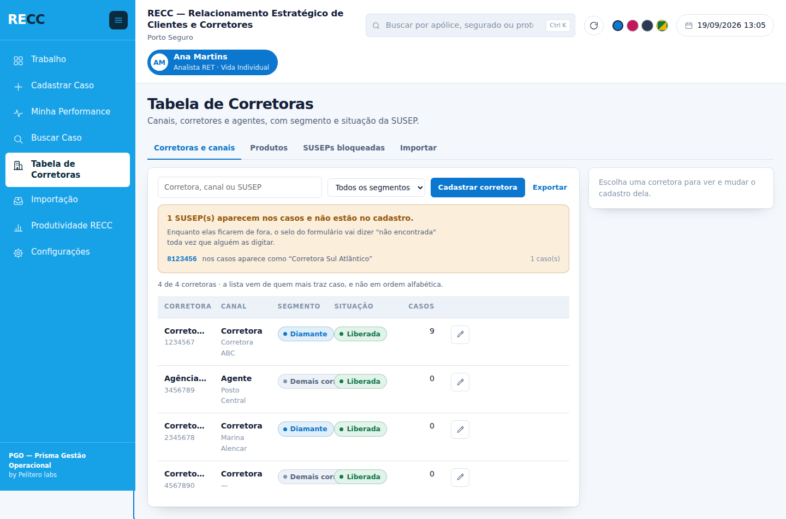

Corretoras, produtos e SUSEPs bloqueadas — três cadastros que até aqui só se
ajustavam abrindo a planilha.

O que faz a tela valer mais que uma lista é o **cruzamento com os casos**: o
volume ao lado de cada corretora, e o aviso das **SUSEPs que aparecem nos casos
e não estão cadastradas**. Enquanto uma delas fica de fora, o selo do
formulário diz "não encontrada" toda vez — e o sintoma aparece em outra tela,
uma pessoa de cada vez, sem ninguém ligar à causa.

**Bloquear não impede cadastrar**: o formulário mostra o selo vermelho com o
motivo, e quem atende decide. Bloqueio que impedisse faria a pessoa registrar o
caso num caderno, e o sistema perderia o caso de vista.

---

## Trazer uma base inteira de fora — a Importação

Toda semana chega uma base para trabalhar: os inadimplentes do Vida Individual,
os do Vida em Grupo, a lista de corretoras que a Mesa vai tratar com ação
diferenciada. Cem casos, trezentos casos. A Importação traz essa base para
dentro do PGO **numa gravação só**, já dividida entre os analistas.

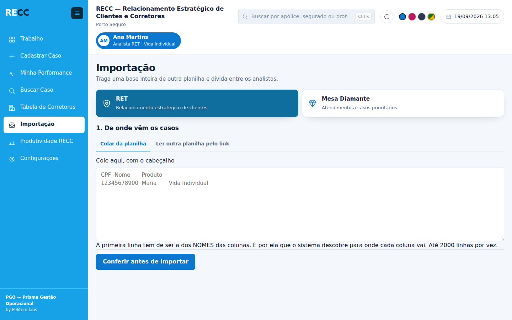

São três passos, e **o do meio é a razão de a tela existir**:

1. **De onde vem.** Colar o conteúdo da outra planilha, ou dar o link dela.
   Colar funciona sempre; o link é melhor para quem repete toda semana, e exige
   que a conta que roda o PGO tenha acesso àquela planilha.
2. **Conferir.** O servidor devolve para onde cada coluna vai, quantas linhas
   entram, quantas repetem — e **as três primeiras já traduzidas**.
3. **Importar.**

O passo 2 não é burocracia. Um mapeamento trocado é invisível olhando o
cabeçalho e óbvio olhando o dado: ver `11999998888` na coluna "CPF" custa cinco
segundos; descobrir isso depois custa achar e apagar trezentas linhas na mão,
numa base que já está sendo trabalhada.

| O que a importação resolve | Como |
|---|---|
| Os cabeçalhos são os da OUTRA planilha | Casa nome com nome e sugere; a pessoa corrige o que não reconheceu |
| A base chega sem responsável | Rodízio em partes iguais entre os analistas marcados |
| A base repete toda semana | Escolhendo a coluna que identifica o caso — CPF, nº da proposta —, o que já está dentro é **pulado**, e o laudo diz quantos |
| O caso precisa nascer trabalhável | Entra com o status padrão do canal: "Não trabalhado", na RET |
| De onde veio cada caso | Grava o **nome do lote** e a **data**, que é o que faz o gráfico existir |

Na Produtividade RECC, dois gráficos respondem ao que a operação pediu — *"no
dia 05 incluímos 100 casos da base de inadimplentes Vida Presente"*: **casos
importados por dia** e **de qual base os casos vieram**, em cada canal.

A importação é a ação `importar`, separada de `criar`: quem cadastra um caso por
vez erra um caso; quem importa errado suja a base toda. De fábrica, Administração
e Coordenação importam; a Operação não.

---

## Duas bases: a operacional e a de cadastros

Corretoras, SUSEPs bloqueadas, produtos e as duas listas de analista — Central e
Cobrança Ativa — podem morar em **outra planilha**. O PGO lê dela na hora, sem
copiar nada: o que mudar lá vale aqui na leitura seguinte.

Duas razões, e as duas importam:

- **Tamanho.** As 7 mil SUSEPs e as 145 corretoras ocupam um pedaço
  considerável do teto de 10 milhões de células. Tirá-las daqui deixa espaço
  para o que a planilha existe para guardar, que é caso.
- **Dono.** Esses cadastros são mantidos por outras áreas. Manter a mesma lista
  em dois lugares é garantir que um dia elas divirjam.

**O PGO lê e não escreve.** A planilha de cadastros é a fonte de verdade; para
mudar um cadastro, edita-se lá. As portas de escrita recusam com uma frase que
diz onde editar — duas mãos escrevendo na mesma lista, uma sem saber da outra, é
como um cadastro começa a divergir.

O que **não** sai desta planilha, e não deve sair: as bases de caso, a
auditoria, os usuários e a configuração. Um sistema que depende de outra
planilha para saber quem pode entrar para de funcionar quando alguém mexe num
compartilhamento.

Aponta-se em Configurações › Estrutura, e há um botão de **conferir antes de
ligar**: ele abre a planilha, olha aba por aba e diz o que falta. Um Id certo
apontando para uma planilha sem as colunas certas abre sem reclamar e devolve
lista vazia depois — o pior dos dois mundos. E quando a planilha não abre, o
sistema **para com o motivo** em vez de devolver lista vazia: "nenhuma SUSEP
está bloqueada" é uma afirmação falsa que deixaria passar um caso que devia ser
barrado.

---

## Configurações, a tela que muda todas as outras

Três colunas: os **assuntos** à esquerda, os **itens** no meio, as
**propriedades** do que foi escolhido à direita. Nada é gravado sem apertar
Salvar.

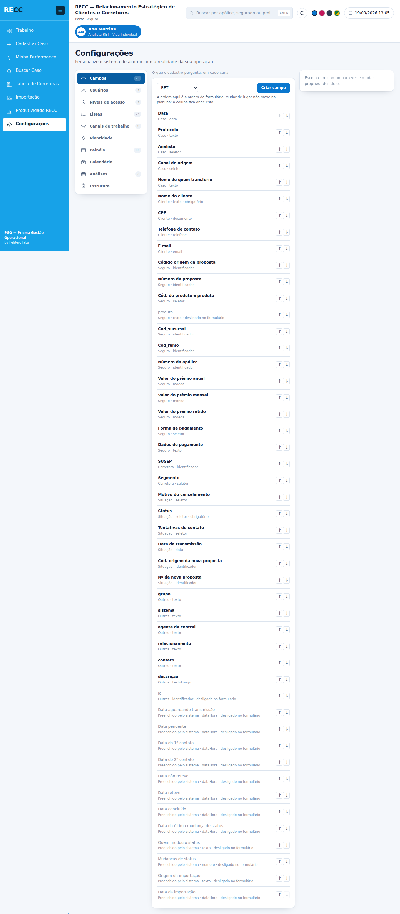

Cada ação carrega a guarda que o estrago dela pede:

| O que se mexe | Guarda | Exemplo |
|---|---|---|
| **Conteúdo** | permissão `configurar` | renomear uma situação, cadastrar pessoa |
| **Regra** | permissão `configurar` | o que um nível pode, quem vê qual campo |
| **Estrutura** | **+ senha de administrador** | criar coluna na planilha |

E as três coisas que o sistema **recusa fazer**, por mais permissão que se
tenha: trocar o cabeçalho de um campo (é o nome da coluna, e o Power BI aponta
para ele), renomear um item de lista que já está gravado em casos, e tirar
Configurações do último nível que ainda a tem — ninguém se tranca do lado de
fora.

Os **cartões são configuráveis um a um** — nome, o que cada um conta, cor,
ordem e mostrar ou ocultar —, e são **duas listas**: a do Trabalho, que mostra o
que ainda dá trabalho, e a da Produtividade RECC, que mostra o que já foi
entregue. Mesma máquina, duas perguntas. Até 12 por tela. Remover um cartão não
toca em caso nenhum — o cartão é uma forma de contar, e apagar a conta não apaga
o que foi contado.

Um cartão conta de quatro maneiras: o **total**, uma **situação**, os
**finalizados na célula** (que é conta, não coluna) e **"já passaram por"** — que
lê a coluna de carimbo, e por isso não zera quando o caso avança.

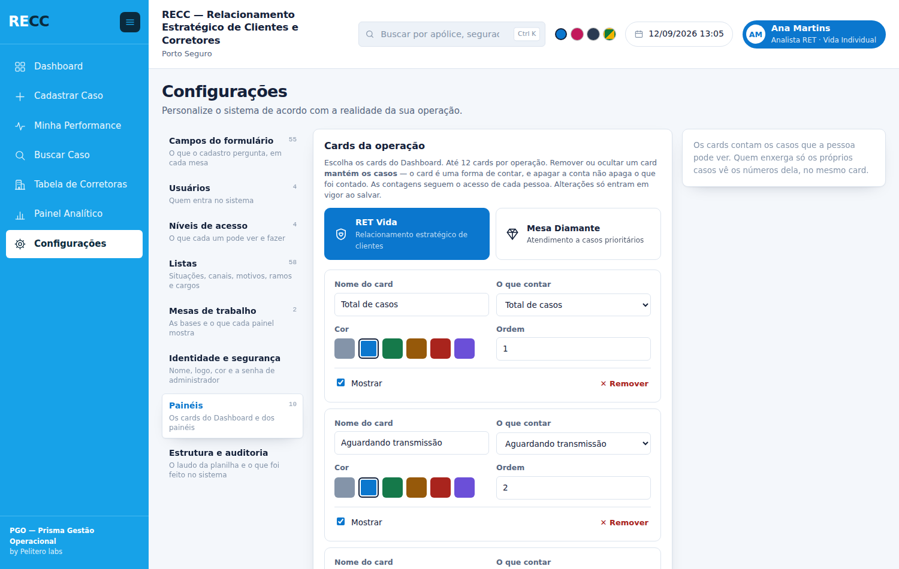

**Configurações permite ajustar tudo?** Quase — e a lista completa, com o que
ainda falta e por quê, está em
[`06-o-que-e-configuravel.md`](Evolucao/06-o-que-e-configuravel.md).

---

## As regras que sustentam o produto

Não são preferências de estilo. Cada uma existe porque a alternativa já causou
prejuízo — a lista completa, com sintoma e causa, está em
[`04-bugs-capturados.md`](Evolucao/04-bugs-capturados.md).

| Regra | Por quê |
|---|---|
| A coluna é encontrada pelo **nome do cabeçalho**, nunca pela posição | Reordenar coluna na planilha não pode quebrar o sistema |
| **Identificador é texto**, formatado na linha antes da gravação | O Planilhas converte `00000010` em `10` e `000000E1` em `0` |
| **Dinheiro é número** com formato de moeda | O `R$` é formato da célula, não conteúdo. O Power BI soma direto |
| Campo de valor **só aceita dígito**, e cresce da direita | `R$ 000.000.000,00`, com duas casas na célula. Um "aprox. 1200" digitado chega ao servidor, não vira número, e a célula fica vazia — o caso é gravado com o valor faltando, sem ninguém notar |
| **Máscara é aparência**: a planilha recebe só dígitos | Cruzamento com outros sistemas sem tratamento |
| Um caso = **uma linha**, sempre | Campo novo vira coluna nova, não linha em tabela de valores |
| Permissão vem do **nível de acesso**, nunca do cargo | O nome do cargo é livre e muda |
| Excluir **some da tela, nunca da planilha** — menos o CASO | Exclusão é lógica (`_Visivel`) e reversível na mão. O caso é a exceção, a pedido da operação: ele sai da planilha de vez, nos dois canais, e o conteúdo fica na auditoria |
| Toda **mudança de status carimba** data e hora na linha do caso — por qualquer porta: diálogo, formulário ou cadastro | É o controle de produtividade. Na auditoria seriam quase um milhão de linhas numa base de 200 mil casos |
| **Erro alto** em vez de padrão silencioso | Dado errado calado é pior que operação parada |
| A estrutura da planilha **nunca muda sozinha** | Só o instalador cria estrutura, e só sobre planilha vazia |
| Esconder botão **não é segurança** | Toda função sensível revalida no servidor |

---

## Estado atual

**14 de 14 etapas construídas.** O detalhe de cada uma está em
[`05-progresso.md`](Evolucao/05-progresso.md).

| ✅ | Fundação · Acesso · Casca · Cadastrar Caso · Trabalho · Configurações · Buscar Caso · Produtividade RECC · Minha Performance · Tabela de Corretoras · Abas de análise · Diagnóstico · Importação · A segunda base |
|---|---|

531 testes, cinco execuções seguidas sem falha, mais as varreduras de navegador:
responsividade em 8 telas × 12 larguras, o roteiro que clica em tudo, os testes
de ponta a ponta — e as imagens deste README, que saem de um gerador e por isso
mostram a tela de hoje.

> **Nada foi implantado ainda.** Enquanto for assim, renomear arquivo e chave de
> tela é barato e se faz. Com o sistema no ar, a chave de uma tela deixa de se
> trocar: o título é configurável exatamente para isso.

---

<sub>Pelitero Labs · PGO — Prisma Gestão Operacional</sub>
