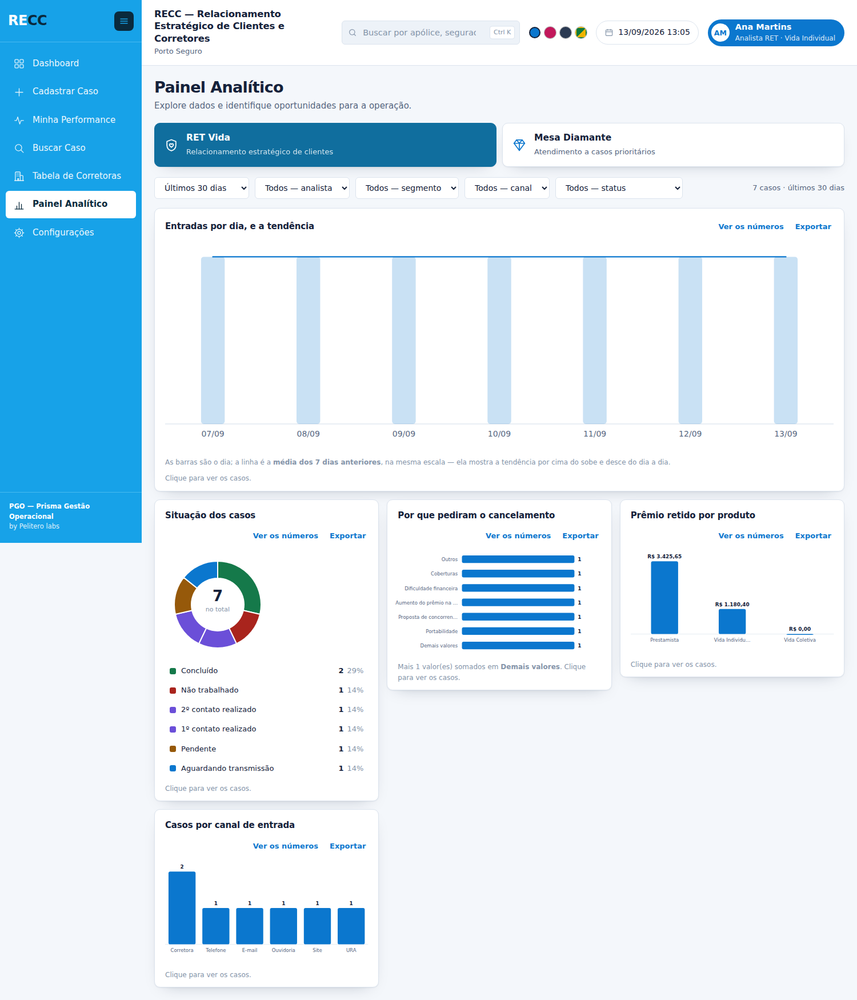

# PGO — Prisma Gestão Operacional

**Sistema de gestão de casos sobre Google Planilhas e Google Apps Script.**
Sem servidor, sem banco de dados externo, sem custo de infraestrutura.

Desenvolvido por **Pelitero Labs**.


> **Uma etapa só está pronta quando funciona, a suíte passa cinco vezes e
> está publicada aqui.** Etapa que fica na máquina de alguém não existe.

---

## O que é

**PGO** é a plataforma, pensada para servir a diferentes operações de
atendimento. **RECC — Relacionamento Estratégico de Clientes e Corretores** é a
operação montada sobre ela, em Porto Seguro.

Nome, subtítulo, logo, cor e até os títulos do menu vivem na **aba `CONFIG` da
planilha**. Servir outra operação é trocar essas linhas, não é mexer em código.

O sistema atende duas mesas de trabalho, e aceita uma terceira sem tocar em
código:

| Mesa | Base | O que é |
|---|---|---|
| **RET Vida** | `BASE_RET` | Retenção — relacionamento estratégico de clientes |
| **Mesa Diamante** | `BASE_MESA` | Atendimento a casos prioritários |

### As telas

`Dashboard` · `Cadastrar Caso` · `Minha Performance` · `Buscar Caso` ·
`Tabela de Corretoras` · `Painel Analítico` · `Configurações`

Cada uma aparece — ou não — conforme o **nível de acesso** de quem entrou.

### Os quatro temas

Trocáveis a qualquer momento, guardados por usuário: **Padrão** (azul da
marca), **Rosa**, **Escuro** e **Brasil**.

| | | |
|---|---|---|
|  |  |  |

---

## Como o repositório está organizado

```
Back-End/     os arquivos .gs — rodam no Apps Script, no servidor do Google
Front-End/    os arquivos .html — rodam no navegador de quem usa
Evolucao/     tudo que NÃO vai para o Apps Script
```

Os nomes das duas primeiras pastas são **etiquetas de destino**: elas dizem
para onde cada arquivo vai no editor do Apps Script. O que separa de verdade os
dois grupos é onde o código executa — `.gs` no Google, `.html` no navegador.

Dentro de `Evolucao/`:

| Caminho | O que é |
|---|---|
| [`01-arquitetura.md`](Evolucao/01-arquitetura.md) | O modelo de dados e **por que** cada decisão foi tomada |
| [`02-padrao-de-codigo.md`](Evolucao/02-padrao-de-codigo.md) | Como os nomes são escolhidos, e as exceções |
| [`03-manutencao.md`](Evolucao/03-manutencao.md) | Como mexer sem quebrar — leia antes de tocar em código |
| [`04-bugs-capturados.md`](Evolucao/04-bugs-capturados.md) | Todo defeito encontrado, com sintoma, causa e defesa |
| [`05-progresso.md`](Evolucao/05-progresso.md) | O estado de cada uma das 12 etapas |
| [`06-o-que-e-configuravel.md`](Evolucao/06-o-que-e-configuravel.md) | O que se ajusta pela tela, o que só na planilha e o que ainda não se ajusta |
| `Testes/` | A suíte: 269 testes, que rodam no computador com `node` |
| `imagens/` | As telas |

---

## Instalação

1. Crie uma planilha **nova e vazia** no Google Planilhas, e um projeto do
   Apps Script vinculado a ela.

2. Copie os arquivos. **O projeto do Apps Script não tem pastas** — as daqui
   são organização do repositório. Há dois caminhos:

   ### O caminho curto: três arquivos

   A pasta **[`Evolucao/pacote/`](Evolucao/pacote/)** tem o sistema inteiro
   junto, pronto para colar:

   | Cole este | Num arquivo chamado | Que é |
   |---|---|---|
   | `Codigo.gs` | `Codigo` (arquivo **.gs**) | os 7 arquivos do servidor |
   | `Index.html` | `Index` (arquivo **HTML**) | o esqueleto com as 10 telas dentro |
   | `SemAcesso.html` | `SemAcesso` (arquivo **HTML**) | a tela de acesso negado |

   **Atenção ao nome:** no Apps Script o arquivo se chama `Index`, e não
   `Index.html` — sem extensão, sem acento, com as maiúsculas iguais.

   > O pacote é **gerado**, não escrito à mão: `node
   > Evolucao/Testes/gerar-pacote.js`. O teste ponta a ponta roda contra ele e
   > contra os 19 arquivos soltos, e cobra que os dois se comportem igual — senão
   > haveria duas verdades, e a que a operação usa seria a que ninguém testa.

   ### O caminho longo: arquivo por arquivo

   Vale quando você vai mexer no código: cada arquivo fica separado por
   assunto, como no repositório.

   | Aqui | No editor do Apps Script |
   |---|---|
   | `Back-End/Entrada.gs` | `Entrada.gs` |
   | `Front-End/Index.html` | `Index.html` |
   | `Evolucao/` | **não vai** |

   São **19 arquivos** — 7 do servidor e 12 de tela —, e basta **um** ficar
   para trás para uma tela congelar numa mensagem de carregamento. A ordem não
   importa: o Apps Script avalia os `.gs` em ordem alfabética, e nenhum tem
   código de topo que dependa de outro.

   | Servidor (7) | Responde |
   |---|---|
   | `Base.gs` | como o sistema fala com a planilha |
   | `Cadastros.gs` | quem traz o caso para dentro |
   | `Casos.gs` | o caso, do formulário à busca |
   | `Config.gs` | o que se ajusta sem programador |
   | `Entrada.gs` | quem entra e o que pode |
   | `Indicadores.gs` | os números |
   | `Instalacao.gs` | criar e conferir a instalação |

   | Tela (12) | O que é |
   |---|---|
   | `Index.html` | o esqueleto, que manda incluir os outros |
   | `Estilos.html` | toda a aparência e os quatro temas |
   | `Comuns.html` | as peças que mais de uma tela usa |
   | `Aplicacao.html` | a ponte com o servidor e o roteador |
   | `Dashboard.html` … `Configuracoes.html` | uma por item do menu (7) |
   | `SemAcesso.html` | a tela de quem não está cadastrado |

   ### O caminho de quem tem terminal: `clasp`

   O `clasp` é a ferramenta oficial do Google e evita a cópia manual por
   completo — os 19 arquivos sobem de uma vez, e sobem de novo a cada mudança:

   ```bash
   npm install -g @google/clasp
   clasp login
   clasp clone <id-do-projeto>   # o id está em Configurações do projeto
   # copie Back-End/*.gs e Front-End/*.html para a pasta clonada
   clasp push
   ```

3. Publique como **aplicativo da web** (executar como você).

4. No editor, execute **`instalarRECC()`** uma vez. Ela cria as 13 abas, semeia
   o catálogo e **cadastra você como o primeiro administrador**.

   > Esse último passo não é conveniência: o acesso é pelo e-mail autenticado
   > conferido contra a aba `USUARIOS`, e uma base nova tem essa aba vazia. Sem
   > ninguém dentro, ninguém entra — e sem entrar, ninguém cadastra.

5. Confira com **`verificarEstruturaRECC()`**. Ela só lê, e diz em segundos
   duas coisas: se alguma **aba** do contrato ficou faltando, e se algum
   **arquivo de tela** ficou para trás na cópia — com o nome de cada um.

   > Nenhum teste rodado fora do Apps Script pega isso: a suíte lê a pasta do
   > repositório, onde os arquivos estão. Quem pode não tê-los é o projeto.
   >
   > No Apps Script o arquivo se chama `Formulario`, e não `Comuns.html`:
   > sem extensão no nome, sem acento, e com as maiúsculas iguais.

6. Se alguma tela ficar **parada numa mensagem de carregamento** — "Lendo o
   cadastro…", "Somando os casos…" —, é arquivo `.gs` que ficou para trás.
   Cole `Evolucao/conferir-projeto.gs` num arquivo novo e execute
   **`oQueFaltaNoProjeto`**: ela não depende de nenhum outro arquivo do PGO e
   diz quais copiar. Depois é só apagá-la.

   > Quando a função não existe no servidor, a chamada estoura antes de sair
   > do navegador, num ponto em que o tratamento de erro da tela ainda nem foi
   > registrado. Nada aparece — a tela só congela.

7. Para a conferência completa, execute **`diagnosticoRECC()`**. São dez
   blocos — fuso, estrutura, sequências de Id, Ids repetidos, mesas, campos,
   painéis, análises, quem consegue configurar, e se toda função que a tela
   chama existe no servidor. Também só lê, e escreve o laudo no log.

   > Ela roda no editor de propósito: é a porta que importa quando o sistema
   > **não abre**. A mesma conferência está em Configurações › Estrutura,
   > atrás de um botão.

8. Abra o sistema e defina a senha de administrador.

**A instalação recusa rodar sobre uma planilha que já tenha dado.** É a única
rotina do sistema que cria estrutura; depois dela, nenhum caminho do produto
cria, renomeia, apaga ou reordena aba e coluna por conta própria.

Nenhum dado operacional é semeado: bases, canais, produtos e SUSEPs bloqueadas
nascem vazios.

---

## Conferir a responsividade

```bash
node Evolucao/Testes/conferir-responsividade.js
```

Abre a prévia num navegador de verdade e percorre **as 7 telas em 12
larguras** — do monitor de 1600px ao celular de 320px —, procurando a página
rolar na horizontal e o elemento que escapou da janela. Tabela dentro de uma
caixa que rola de propósito não conta: rolar a tabela é a solução, não o
problema.

Precisa do Playwright, e por isso fica **fora** da suíte: `rodar.js` roda com
`node` puro, sem instalar nada, e essa promessa vale mais do que ter tudo num
comando só.

---

## Rodar os testes

```bash
node Evolucao/Testes/rodar.js
```

269 testes. O critério de aceite é **cinco execuções seguidas sem falha** —
rodar uma vez não detecta teste instável.

A suíte roda contra um Google Planilhas falso que **converte valores igual ao
de verdade**: numa célula de formato Geral, `'00000010'` vira `10` e
`'000000E1'` vira `0`. Há um teste dedicado só a provar que o simulador
realmente corrompe — sem ele, os outros 268 não valeriam nada.

## Ver as telas sem publicar

```bash
node Evolucao/Testes/gerar-previa.js
```

Escreve `previa/sistema.html` e `previa/sem-acesso.html`, que abrem em qualquer
navegador. São montados pelo **mesmo código do servidor**; só a ponte com o
Google é substituída. Serve para conferir menu, temas e navegação sem publicar
a cada mudança.

---

## A visão do dia

Cartões e fila saem da **mesma lista**, já filtrada pelo alcance do nível — por
isso o número do cartão sempre bate com o que a fila mostra. Os filtros são os
campos que já são lista: nada escrito em código.


A fila vem em **grupos**: várias colunas debaixo de um título só, com a
primeira em destaque. Um caso da RET tem trinta e cinco colunas — seis lado a
lado perdem o resto, e trinta e cinco não cabem.

Clicar em **Ver detalhes** abre o caso por cima, e fechar devolve a fila
exatamente como estava. Campo em branco aparece com um travessão: sumir faria
a pessoa achar que o campo não existe naquela mesa.


Cada linha tem quatro ações: ver, editar, **alterar situação** — um diálogo só
com a situação, porque é o gesto mais frequente da operação — e excluir, que
tira o caso do sistema e **mantém a linha na planilha**.

---

## O cadastro de casos

O formulário **não está escrito no código**. Ele é montado a partir da aba
`CAMPOS` toda vez que a tela abre — campo criado em Configurações aparece
sozinho, e campo oculto para o nível de acesso nem chega ao navegador.


O selo da SUSEP responde três coisas, e as três são informação: **liberada**
com o segmento, **bloqueada** com o motivo, ou **não encontrada** — que não é
erro, é uma corretora que o cadastro ainda não conhece.

---

## Achar um caso que a fila não mostra mais

O Dashboard mostra os últimos 30 dias, de propósito. Quando o cliente liga
citando um protocolo de abril, é aqui que se procura.


A tela existe sobre uma regra: **ler a coluna antes de ler as linhas**. Uma
base de 200 mil linhas por 39 colunas são 7,8 milhões de células — ler tudo
estoura o tempo do Apps Script. Lemos só as **colunas de busca** que a mesa
declarou, anotamos em quais linhas o termo aparece, e só então lemos inteiras
as poucas que casaram.

A comparação **ignora máscara nos dois sentidos**: `123.456.789-01` acha
`12345678901` e vice-versa. E quando há uma **planilha legada** apontada, ela
entra como uma origem a mais — lida como está, em leitura, sem prometer
edição do que não é caso do sistema.

---

## O que está acontecendo na operação



Cada gráfico é uma linha da aba `PAINEIS` — nada aqui está escrito no código.
Cinco formas: pizza, barras em pé, barras deitadas, linha e barras com linha.
Clicar numa fatia abre a lista dos casos que a formam.

Três regras sustentam a leitura, e cada uma existe por um motivo:

- **Um eixo só.** "Barras com linha" não são duas escalas — a linha é a
  **média móvel de 7 dias da própria barra**, na mesma altura. Dois eixos
  fazem a mesma altura significar duas coisas
- **Cor para identidade, tom único para magnitude.** A pizza responde "de que
  tipo são" e usa cores; as barras respondem "quanto" e usam um tom só
- **Cor segue a entidade, nunca a posição.** "Concluído" é verde porque o
  catálogo diz que é, e continua verde depois de qualquer filtro

A paleta é de seis tons em ordem fixa, **conferidos por régua**: ΔE 9,1 de
separação mínima sob daltonismo, 19,6 na visão normal. Um sétimo valor vira
"Demais valores", nunca uma cor nova. E como três dos seis ficam abaixo de
3:1 de contraste, todo gráfico traz o **número visível**, a **tabela** a um
clique e a dica no passar do mouse — cor é a segunda leitura, nunca a única.

---

## A tela em que o analista se vê


As outras telas mostram a operação; esta mostra **uma pessoa**, e o cuidado é
de outra natureza. Um número mal escolhido no Dashboard atrapalha uma decisão;
aqui, atrapalha alguém.

- **O ranking segue o alcance do nível.** Quem só enxerga os próprios casos não
  vê nome de colega — vê a própria posição contra a média. E quem pode ver
  recebe os **vizinhos**, não o pódio: um pódio diz pouco a quem está no meio e
  demais sobre quem está embaixo
- **Todo número vem com a sua base**, e a média da equipe aparece sempre
- **No tempo médio, menos é melhor** — cair é verde. A mesma seta para baixo em
  "concluídos" é o contrário
- **O que não dá para calcular some**, em vez de aparecer zerado
- **A meta é declarada, nunca inventada.** Mesa sem meta não ganha barra

---

## Quem traz o caso para dentro


Corretoras, produtos e SUSEPs bloqueadas — três cadastros que até aqui só se
ajustavam abrindo a planilha.

O que faz a tela valer mais que uma lista é o **cruzamento com os casos**: o
volume ao lado de cada corretora, e o aviso das **SUSEPs que aparecem nos casos
e não estão cadastradas**. Enquanto uma delas fica de fora, o selo do
formulário diz "não encontrada" toda vez — e o sintoma aparece em outra tela,
uma pessoa de cada vez, sem ninguém ligar à causa.

**Bloquear não impede cadastrar**: o formulário mostra o selo vermelho com o
motivo, e quem atende decide. Bloqueio que impedisse faria a pessoa registrar o
caso num caderno, e o sistema perderia o caso de vista.

---

## Configurações, a tela que muda todas as outras

Três colunas: os **assuntos** à esquerda, os **itens** no meio, as
**propriedades** do que foi escolhido à direita. Nada é gravado sem apertar
Salvar.


Cada ação carrega a guarda que o estrago dela pede:

| O que se mexe | Guarda | Exemplo |
|---|---|---|
| **Conteúdo** | permissão `configurar` | renomear uma situação, cadastrar pessoa |
| **Regra** | permissão `configurar` | o que um nível pode, quem vê qual campo |
| **Estrutura** | **+ senha de administrador** | criar coluna na planilha |

E as três coisas que o sistema **recusa fazer**, por mais permissão que se
tenha: trocar o cabeçalho de um campo (é o nome da coluna, e o Power BI aponta
para ele), renomear um item de lista que já está gravado em casos, e tirar
Configurações do último nível que ainda a tem — ninguém se tranca do lado de
fora.

Os **cards do Dashboard** são configuráveis um a um: nome, o que cada um
conta, cor, ordem e mostrar ou ocultar. Até 12 por operação. Remover um card
não toca em caso nenhum — o card é uma forma de contar, e apagar a conta não
apaga o que foi contado.


**Configurações permite ajustar tudo?** Quase — e a lista completa, com o que
ainda falta e por quê, está em
[`06-o-que-e-configuravel.md`](Evolucao/06-o-que-e-configuravel.md).

---

## As regras que sustentam o produto

Não são preferências de estilo. Cada uma existe porque a alternativa já causou
prejuízo — a lista completa, com sintoma e causa, está em
[`04-bugs-capturados.md`](Evolucao/04-bugs-capturados.md).

| Regra | Por quê |
|---|---|
| A coluna é encontrada pelo **nome do cabeçalho**, nunca pela posição | Reordenar coluna na planilha não pode quebrar o sistema |
| **Identificador é texto**, formatado na linha antes da gravação | O Planilhas converte `00000010` em `10` e `000000E1` em `0` |
| **Dinheiro é número** com formato de moeda | O `R$` é formato da célula, não conteúdo. O Power BI soma direto |
| **Máscara é aparência**: a planilha recebe só dígitos | Cruzamento com outros sistemas sem tratamento |
| Um caso = **uma linha**, sempre | Campo novo vira coluna nova, não linha em tabela de valores |
| Permissão vem do **nível de acesso**, nunca do cargo | O nome do cargo é livre e muda |
| Excluir **some da tela, nunca da planilha** | Exclusão é lógica (`_Visivel`), e reversível na mão |
| **Erro alto** em vez de padrão silencioso | Dado errado calado é pior que operação parada |
| A estrutura da planilha **nunca muda sozinha** | Só o instalador cria estrutura, e só sobre planilha vazia |
| Esconder botão **não é segurança** | Toda função sensível revalida no servidor |

---

## Estado atual

**5 de 12 etapas construídas.** O detalhe de cada uma está em
[`05-progresso.md`](Evolucao/05-progresso.md).

| ✅ | Fundação · Acesso · Casca · Cadastrar Caso · Dashboard |
|---|---|
| 🔨 | Configurações |
| ⏳ | Buscar Caso · Painel Analítico · Minha Performance · Tabela de Corretoras · Abas de análise · Diagnóstico |

---

<sub>Pelitero Labs · PGO — Prisma Gestão Operacional</sub>
